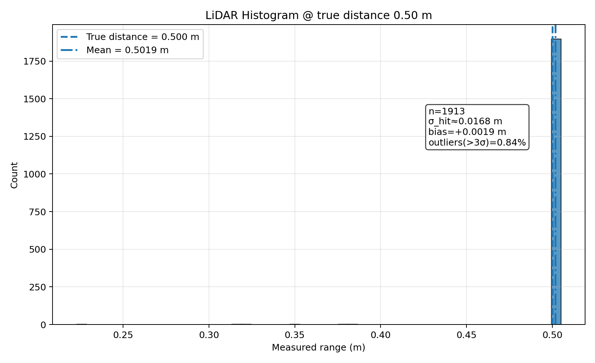
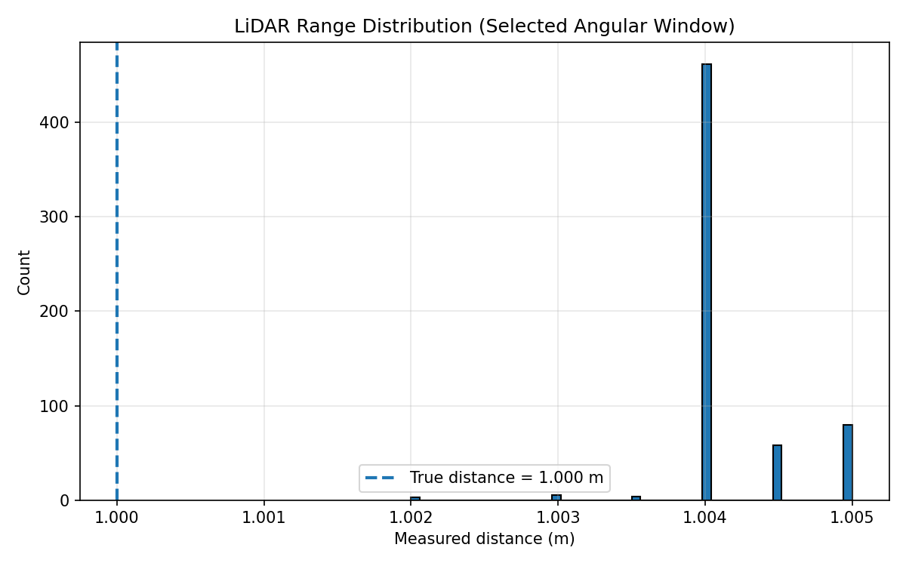
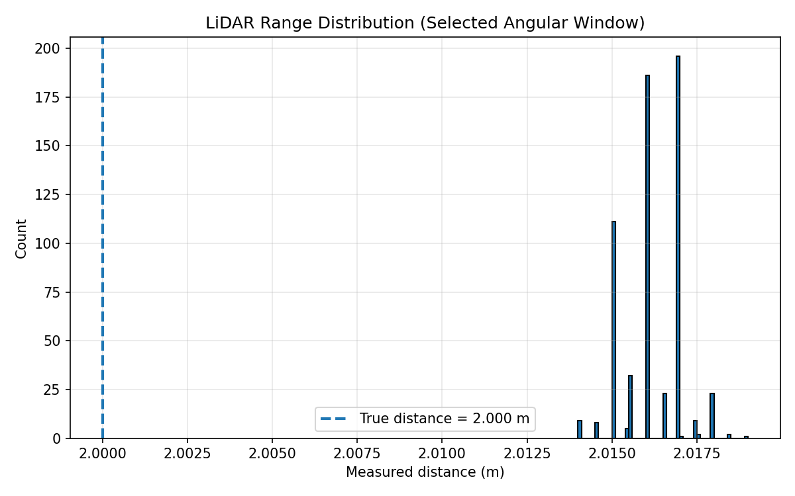

# Proj5 Group 4 — LiDAR Calibration Analysis

## 1. Project Overview
This project analyzes ROS 2 LiDAR calibration bag files recorded at known distances (0.5 m, 1.0 m, and 2.0 m) to evaluate sensor performance. The analysis computes summary statistics from LaserScan data and generates histogram plots for each test distance.

The main goals are:
- Measure **accuracy** (bias/error from the true distance)
- Measure **precision** (spread/noise of repeated measurements)
- Compare performance at multiple distances

---

## 2. Data Used
The following ROS 2 bag directories were analyzed:

- `data/lidar_calibration_/lidar_calibration_05m`
- `data/lidar_calibration_/lidar_calibration_1m`
- `data/lidar_calibration_/lidar_calibration_2m`

Topic used:
- `/scan` (`sensor_msgs/msg/LaserScan`)

The analysis focuses on measurements near the forward direction using:
- `target-angle = 0.0 rad`
- `angle-window = 0.1 rad` (±0.1 rad around the target angle)

This isolates a narrow forward-facing slice of the scan to estimate the distance directly in front of the LiDAR.

---

## 3. Environment / Dependencies
### System
- Ubuntu (fill in your version if known)
- ROS 2 Jazzy
- Python 3

### Python packages
- `numpy`
- `matplotlib`
- `pyyaml`

### Virtual environment (recommended)
This project was run inside a Python virtual environment (`.venv`) to avoid Ubuntu's system Python package restrictions (PEP 668).

---

## 4. Setup Instructions (Step-by-Step)

## Histogram Figures

### 0.5 m Histogram


### 1.0 m Histogram


### 2.0 m Histogram


## 3. Parameter Estimation and Results

### 3.1 Summary Table

| True Distance (m) | Mean Measured (m) | Sigma σ_hit (m) | Bias (m) | Samples (N) | Outliers (>3σ) | Outlier Rate (%) |
|---|---:|---:|---:|---:|---:|---:|
| 0.5 | 0.501861 | 0.016781 | +0.001861 | 1913 | 16 | 0.836 |
| 1.0 | 1.003373 | 0.001014 | +0.003373 | 1836 | 0 | 0.000 |
| 2.0 | 2.015235 | 0.002099 | +0.015235 | 1824 | 7 | 0.384 |


### 4.1 Go to project folder
```bash
cd ~/Proj5_group4

